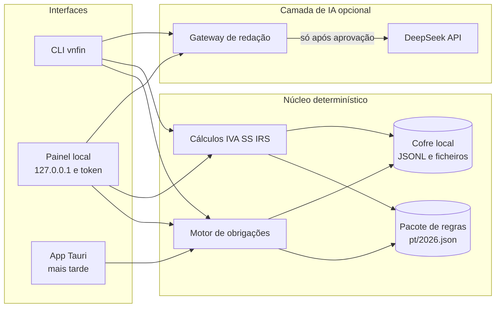

# Architecture

How the pieces fit, why the boundaries are where they are, and where to put a new
piece of behaviour. `AGENTS.md` states the rules; this file explains the shape they
protect. `README.md` is the user-facing document.

## The constraint that produces the design

Three requirements, decided before any code, explain almost every structural choice:

1. **Nothing leaves the machine.** No server, no sync, no telemetry. One folder the
   user owns is the whole persistence layer.
2. **The single network call is a rule-pack update.** It carries public-law variable
   names and values, is built from the rule pack alone, and cannot be triggered
   implicitly. Estimates and alerts never involve a model.
3. **A number is either computed from a cited rule or refused.** No guessed tax
   figures, no silent default for a missing personal input.

The browser panel is the primary interface, so the design keeps the interface thin:
one view model, no tax logic in the front end, and every write on the same path.

## Layer map

The published figure (library id `vn-finance-architecture`, also cited by
`README.md`), reproduced here so the document stands on its own:

Read it with the file names in mind: the panel talks to the local server
(`src/web/server.ts`), which builds one view model (`src/web/report.ts`) from the
core and the vault; the "motor de obrigações" is `calendar.ts` + `conditions.ts`, the
"cálculos" are `estimate.ts` + `money.ts`, and the rule pack is read through
`rules.ts`. The Tauri shell is a later milestone, not a thing in this repository
today.

The dependency rule is one-directional: interfaces depend on the web layer, the web
layer depends on the core and the vault, and the core depends on nothing but Node's
standard library. `src/core/` performs no I/O and holds no clock — the date enters as
a parameter (`today`), which is what makes the calendar tests deterministic.

## Layers

### `src/core/` — the domain

Pure functions over plain data. No files, no network, no `Date.now()`.

| Module | Responsibility |
| --- | --- |
| `types.ts` | The shared vocabulary: `TaxProfile`, `RulePack`, `ObligationRule`, `ObligationInstance`, `LoadedPack` |
| `money.ts` | Integer cents and basis points, parsing and formatting of Portuguese amounts |
| `dates.ts` | ISO dates, `todayInLisbon`, Portuguese formatting |
| `calendar.ts` | `buildAgenda`/`upcoming`: rules plus a profile become dated obligation instances with a status |
| `conditions.ts` | Evaluation of a rule's applicability conditions against a profile |
| `rules.ts` | Loading, validating and summarising the rule pack; year resolution and freshness |
| `profile.ts` | Building, validating and importing the profile; the inputs only the taxpayer can supply |
| `nif.ts` | NIF syntax and check digit, masking |
| `estimate.ts` | Invoice totals, quarterly totals, Segurança Social, reserve, simplified-regime IRS base |
| `flags.ts` | Alerts, computed in code, plus rule-pack health flags |

### `src/store/vault.ts` — persistence

One directory: `profile.json`, `ledger/invoices.jsonl`, `obligations/completions.jsonl`,
`documents/` with `documents/index.json`, `audit/audit.jsonl`, `ai/deepseek.key`,
`rules/proposals-<year>.json`.

- **Append-only JSONL** for invoices, completions and audit events: "what did I
  record, and when" is part of the record.
- **Atomic replacement** for whole-file writes (`writeJson`: temporary file, then
  rename), so an interrupted write cannot leave a half-written profile.
- **Copy before index** for documents: the file is in the vault before the index
  entry that names it, so the index can never point at a missing file.
- **Hash-addressed documents**: the stored name starts with 12 hex characters of the
  SHA-256. `addDocument` archives a path; `addDocumentBytes` archives bytes that
  arrived over the wire, because a browser has bytes and not paths. Both funnel into
  one private `indexDocument`, so there is exactly one archive rule.
- **Data-dir risk** (`checkDataDirRisk`): a vault inside *this* repository is
  refused; a vault inside any other git work tree is a loud warning.

### `src/web/report.ts` — the view model

`buildDashboard` assembles **one** payload per request: meta, guarantees, defaults,
profile and its problems, missing inputs, pack summary and freshness, agenda, flags,
quarter reports, reserve, invoices, vault index, rules, update state, key state.

One payload rather than a dozen endpoints because the panel is on loopback and a
single snapshot cannot show an agenda from one moment beside flags from another. It
is also the enforcement point for "no tax logic in the front end": every figure the
panel prints was computed here by the core.

### `src/web/server.ts` — the local server

No framework, no dependency, `node:http`. Security guards, in order of application:

| Guard | What it stops |
| --- | --- |
| Binds `127.0.0.1` only | Anything else on the network |
| `Host` allowlist (`127.0.0.1`, `localhost`, `[::1]` with the bound port) | DNS rebinding: a foreign hostname resolving to loopback |
| Per-run token, timing-safe compare, on every `/api` call | A foreign page reading the ledger or writing an invoice |
| No CORS headers, `OPTIONS` refused | Cross-origin reads and preflighted writes |
| CSP with no inline script/style, plus `nosniff`, `DENY`, `no-referrer` | Injection and framing |
| Path containment under `public/` | Directory traversal |
| Body caps: 256 KiB JSON, 32 MiB upload | Memory exhaustion |

Routes (`API_ROUTES` maps every path to the one method it accepts):

| Route | Does |
| --- | --- |
| `GET /api/dashboard` | The whole view model |
| `POST /api/profile` | Create the profile when the vault is empty, update it otherwise; `replace: true` writes a whole one |
| `POST /api/profile/import` | A profile that arrived as a file, normalised and validated |
| `GET /api/profile/export` | The stored profile, to carry to another machine |
| `POST /api/invoices` | Record an invoice, rejecting self-contradictory treatment/rate pairs |
| `POST /api/obligations/complete` | Mark an obligation handled |
| `POST /api/documents` | Archive a file by absolute path (the CLI's route) |
| `POST /api/documents/upload` | Archive bytes uploaded by the browser; the one non-JSON body |
| `POST /api/estimate/irs` | The simplified-regime taxable base for a given expense figure; stores nothing |
| `POST /api/ai-key` | Use, store, forget or delete the DeepSeek credential |
| `POST /api/ai-key/unlock` | Open a stored key with its passphrase for this process |
| `POST /api/update/send` | Fetch a rule-value proposal from DeepSeek and store it pending |
| `POST /api/update/apply` | Apply a pending proposal, confirmed or unconfirmed |
| `POST /api/update/discard` | Delete a pending proposal |

The server contains no tax logic: handlers validate shapes TypeScript cannot see,
call the core, write through the vault and return the rebuilt model. A handler that
grows an `if` about tax belongs in `src/core/`.

### `src/ai/` — the bounded assistant

- `redact.ts` — the branded request type. The update request is assembled from the
  rule pack; a redaction pass plus a residual scan make a leaked identifier fail
  closed instead of shipping.
- `deepseek.ts` — the only HTTP client, with `scrubCredentials` on every error path
  so a provider message cannot echo the key back.
- `update.ts` — `buildUpdateRequest` → `parseUpdateResponse` → `diffProposal` →
  `applyProposal`. Unit and magnitude validation rejects a plausible-looking value in
  the wrong unit; an applied value is recorded as `ai-proposed` and stays
  `unverified` until a human confirms it.
- `keyring.ts` — resolution order `--key` → `DEEPSEEK_API_KEY` → encrypted file, plus
  `session`, the panel's in-memory key. The file is AES-256-GCM with a scrypt-derived
  key (N=2¹⁵, r=8, p=1), mode `0600`, minimum passphrase length 12.

### `src/web/public/` — the panel

One HTML file, one stylesheet, one ES module, no build step, no framework, nothing
loaded from outside. `app.js` formats and lays out; it never decides a tax question.
State lives in one object (`state`) and every mutation re-renders the whole model
(`applyModel`) rather than patching the DOM, which is why a form's values are the
only thing the front end is allowed to convert (euros → cents, percent → basis
points) — that conversion is the API contract.

## Data flow

Read: `GET /api/dashboard` → `buildModel` → `loadCurrentPack` + `resolveContextKey` →
`buildDashboard` (vault + core) → one JSON payload → `render(model)` → `innerHTML`.

Write: form → `send()` → route → handler → core validation → `Vault` write + audit
event → rebuilt model → `applyModel` → full re-render. A write never patches the DOM
optimistically: what the panel shows after a save is what the vault just returned.

## Rule pack

`src/rules/pt/2026.json` is the only place tax law is written down: `constants`
(IVA rates, IRS coefficients, IAS, ceilings), `obligations` (kind, tax, periodicity,
legal basis, `documentsToKeep`), `sources` (authority, tier, URL, retrieval date) and
`todo`. Every obligation and constant carries a verification state — `verified`,
`partial`, `unverified`, `stale` — and an unverified rule is displayed as such
instead of being trusted. A constant with no value (`null`) makes the calculations
that depend on it *refuse* rather than assume.

`summarisePack` produces the counts shown by `doctor`, the panel and the sidebar
badge; `freshness` reports whether the pack covers the requested year or is
provisional.

## Interface parity

The CLI and the panel are two views of the same core. Nothing tax-related exists in
only one of them.

| CLI | Panel |
| --- | --- |
| `vnfin` / `vnfin web` | The panel itself, opened at `http://127.0.0.1:<port>/?t=<token>` |
| `init` | *Perfil* — create, edit, import, export |
| `doctor` | *Diagnóstico* — profile, pack, vault, data-dir risk, key, verdict |
| `agenda` | *Agenda fiscal* with the 30/90-day, year, done and N/A filters |
| `flags` | The alert block at the top of the panel |
| `rules` | *Regras e fontes* |
| `estimate` | *Segurança Social* and *IVA e IRS* (quarter reports and reserve) |
| `estimate --despesas` | *IVA e IRS* → the taxable-income calculator (`POST /api/estimate/irs`) |
| `ledger list` / `ledger add` | *Recibos emitidos* and the *Nova fatura-recibo* form |
| `vault list` / `vault add` | *Cofre de documentos* — file picker (upload) or absolute path |
| `ai-key status` / `ai-key set` | *Diagnóstico* → the DeepSeek key panel |
| `update --send` / `--approve` | *Atualizar regras*, in three explicit steps |

## Testing

`npm run verify` = `tsc --noEmit` + `node --test` over the files listed in
`package.json` (add a new file there or it never runs).

| Suite | Covers |
| --- | --- |
| `src/core/*.test.ts` | Money, calendaring against the published 2026 dates, conditions, rule packs, profile, flags, estimates |
| `src/ai/redact.test.ts`, `src/ai/update.test.ts` | What the assistant may see, unit and magnitude validation, the diff/apply cycle |
| `src/web/server.test.ts` | Guards (token, `Host`, traversal, CSP, no CORS, body caps), the dashboard contract, invoices, completions, and the browser-only surface: diagnostics, the key lifecycle, uploads, the IRS calculator |
| `src/web/profile-api.test.ts` | First run with an empty vault, create/replace/import/export |

Structure is tested, not just behaviour: the asset test asserts the page has no
inline script or style (the CSP forbids both), and a mojibake guard fails the suite
if UTF-8 Portuguese was decoded as cp1252.

## Where to add things

- **A new obligation or constant** → edit `src/rules/pt/2026.json` with its source and
  verification state; the engine, the agenda, the panel and `rules` pick it up.
  Nothing else needs to change, and nothing may hardcode the value.
- **A new computed fact** → add a pure function in `src/core/`, expose it on
  `DashboardModel` in `report.ts`, render it in `app.js`, and add the equivalent to
  the relevant CLI command.
- **A new write** → a route in `API_ROUTES`, a handler that validates shapes, calls
  the core, writes through `Vault` with an audit event, returns the rebuilt model;
  then a form in the panel and a command in `cli.ts`.
- **A new panel section** → a `render*` function returning one `<section
  id="...">` string, pushed in `render()`, linked from the sidebar in `index.html`,
  with a counter in `renderChrome` if it has a state worth counting.
- **A new secret or user-supplied input** → never defaulted; ask for it, validate it,
  and say which check cannot run without it.

## Known gaps

Deliberately not built, and described as such rather than half-done: the printable
year pack, trend/comparison views, a keyboard-first agenda path, the expense ledger
with categories, CSV/SAF-T import, encrypted backup export with a verified restore,
the Tauri desktop shell, OS credential-store key storage, and encryption of the
vault at rest. `docs/ROADMAP.md` carries the milestones; `docs/PRIVACY-SECURITY.md`
states the residual risks plainly.
