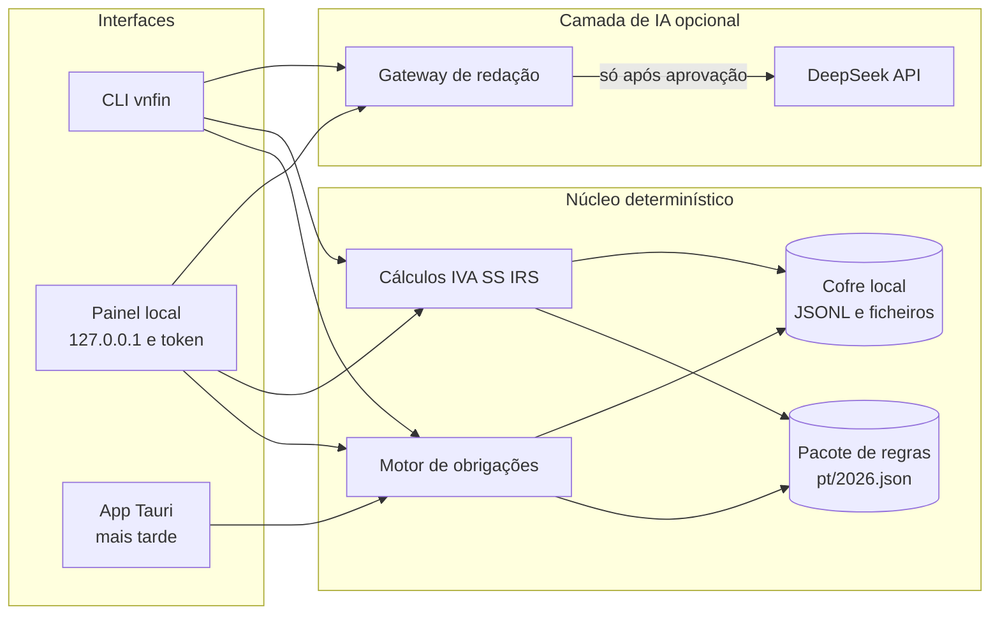

# Architecture

How the pieces fit, why the boundaries are where they are, and where to put a new
piece of behaviour. `AGENTS.md` states the rules; this file explains the shape they
protect. `README.md` is the user-facing document.

## The constraint that produces the design

Three requirements, decided before any code, explain almost every structural choice:
1. **Nothing leaves the machine.** No server, no sync, no telemetry. One folder the
   user owns is the whole persistence layer.
2. **The single network call is a rule-pack update.** It carries public-law variable
   names and values, is built from the rule pack alone, and cannot be triggered
   implicitly. Estimates and alerts never involve a model.
3. **A number is either computed from a cited rule or refused.** No guessed tax
   figures, no silent default for a missing personal input.

The browser panel is the primary interface, so the design keeps the interface thin:
one view model, no tax logic in the front end, and every write on the same path.

## Layer map

The published figure (library id `vn-finance-architecture`, also cited by
`README.md`), reproduced here so the document stands on its own:

Read it with the file names in mind: the panel talks to the local server
(`src/web/server.ts`), which builds one view model (`src/web/report.ts`) from the
core and the vault; the "motor de obrigações" is `calendar.ts` + `conditions.ts`, the
"cálculos" are `estimate.ts` + `money.ts`, and the rule pack is read through
`rules.ts`. The Tauri shell is a later milestone, not a thing in this repository
today.

The dependency rule is one-directional: interfaces depend on the web layer, the web
layer depends on the core and the vault, and the core depends on nothing but Node's
standard library. `src/core/` performs no I/O and holds no clock — the date enters as
a parameter (`today`), which is what makes the calendar tests deterministic.

## Layers

### `src/core/` — the domain

Pure functions over plain data. No files, no network, no `Date.now()`.

| Module | Responsibility |
| --- | --- |
| `types.ts` | The shared vocabulary: `TaxProfile`, `RulePack`, `ObligationRule`, `ObligationInstance`, `LoadedPack` |
| `money.ts` | Integer cents and basis points, parsing and formatting of Portuguese amounts |
| `dates.ts` | ISO dates, `todayInLisbon`, Portuguese formatting |
| `calendar.ts` | `buildAgenda`/`upcoming`: rules plus a profile become dated obligation instances with a status |
| `conditions.ts` | Evaluation of a rule's applicability conditions against a profile |
| `rules.ts` | Loading, validating and summarising the rule pack; year resolution and freshness |
| `profile.ts` | Building, validating and importing the profile; the inputs only the taxpayer can supply |
| `nif.ts` | NIF syntax and check digit, masking |
| `estimate.ts` | Invoice totals, quarterly totals, Segurança Social, reserve, simplified-regime IRS base |
| `flags.ts` | Alerts, computed in code, plus rule-pack health flags |
| `pdf.ts` | Reading a PDF's text: object graph, page tree, `FlateDecode`, `/ToUnicode`, rows by baseline |
| `receipt.ts` | A `fatura-recibo` read out of those rows, checked against its own arithmetic, and mapped to a ledger invoice |

`pdf.ts` is the one module that is not about tax at all. It exists because the
application has zero runtime dependencies and a `fatura-recibo` is a *form*:
reading six labelled figures out of one is a bounded problem, and a rendering
engine with its own font stack and update cadence would be a much larger
liability than the few hundred lines that solve it. It reports what it cannot do
— an encrypted file, an object-stream layout, a two-byte font with no character
map, a stream that will not inflate — instead of returning empty text, because
"we could not read this" and "this document is empty" must never be confused.

`receipt.ts` is where that reading becomes a tax record, and it states its two
rules at the top: a figure is read or it is absent (there is no default, no
"probably 23%"), and the document is checked against itself (base + IVA + stamp
duty = total; total − retention = payable; rate × base = IVA). Those checks run
in the core so the panel and the command line report the same disagreements
*before* anything reaches the ledger. The refusal that matters most is the first
one in `invoiceFromReceipt`: a document whose "prestador" NIF is not the
profile's NIF is somebody else's invoice — an expense, and there is no expense
ledger yet — so it is refused with an explanation rather than recorded as income.

### `src/store/vault.ts` — persistence

One directory: `profile.json`, `ledger/invoices.jsonl`, `obligations/completions.jsonl`,
`documents/` with `documents/index.json`, `audit/audit.jsonl`, `ai/deepseek.key`,
`rules/proposals-<year>.json`. Which directory is *remembered* in
`~/.vn-finance/vault-location.json` (`resolveVaultLocation` → `flag` → `env` →
`pointer` → `default`, in that order of precedence), so a folder somebody chose
in the panel is found again by the command line.

- **Append-only JSONL** for invoices, completions and audit events: "what did I
  record, and when" is part of the record.
- **Atomic replacement** for whole-file writes (`writeJson`: temporary file, then
  rename), so an interrupted write cannot leave a half-written profile.
- **Copy before index** for documents: the file is in the vault before the index
  entry that names it, so the index can never point at a missing file.
- **Hash-addressed documents**: the stored name starts with 12 hex characters of
  the SHA-256. `addDocument` archives a path; `addDocumentBytes` archives bytes that
  arrived over the wire, because a browser has bytes and not paths. Both funnel into
  one private `indexDocument`, so there is exactly one archive rule. An entry may
  carry an `invoiceId`: that is a `fatura-recibo` that was read into the ledger,
  and it is what lets the panel answer "which invoice is this PDF?" as well as
  "which PDF is this invoice?".
- **Data-dir risk** (`checkDataDirRisk`): a vault inside *this* repository is
  refused; a vault inside any other git work tree is a loud warning. The same
  check gates the folder chooser, so the refusal is explained where the choice is
  made.
- **`browseDirectories`** lists the *sub-directories* of a path for the folder
  chooser, and never their contents: the picker needs to know what can be
  entered, and a listing that also returned file names would hand any page
  holding the session token a way to read the shape of the disk.

### `src/web/report.ts` — the view model

`buildDashboard` assembles **one** payload per request: meta, guarantees, defaults,
profile and its problems, missing inputs, pack summary and freshness, agenda, flags,
quarter reports, reserve, invoices, vault index, rules, update state, key state.

One payload rather than a dozen endpoints because the panel is on loopback and a
single snapshot cannot show an agenda from one moment beside flags from another. It
is also the enforcement point for "no tax logic in the front end": every figure the
panel prints was computed here by the core.

### `src/web/server.ts` — the local server

No framework, no dependency, `node:http`. Security guards, in order of application:

| Guard | What it stops |
| --- | --- |
| Binds `127.0.0.1` only | Anything else on the network |
| `Host` allowlist (`127.0.0.1`, `localhost`, `[::1]` with the bound port) | DNS rebinding: a foreign hostname resolving to loopback |
| Per-run token, timing-safe compare, on every `/api` call | A foreign page reading the ledger or writing an invoice |
| No CORS headers, `OPTIONS` refused | Cross-origin reads and preflighted writes |
| CSP with no inline script/style, plus `nosniff`, `DENY`, `no-referrer` | Injection and framing |
| Path containment under `public/` | Directory traversal |
| Body caps: 256 KiB JSON, 32 MiB upload | Memory exhaustion |

Routes (`API_ROUTES` maps every path to the one method it accepts):

| Route | Does |
| --- | --- |
| `GET /api/dashboard` | The whole view model |
| `POST /api/profile` | Create the profile when the vault is empty, update it otherwise; `replace: true` writes a whole one |
| `POST /api/profile/import` | A profile that arrived as a file, normalised and validated |
| `GET /api/profile/export` | The stored profile, to carry to another machine |
| `POST /api/invoices` | Record an invoice, rejecting self-contradictory treatment/rate pairs |
| `POST /api/obligations/complete` | Mark an obligation handled |
| `POST /api/documents` | Archive a file by absolute path (the CLI's route) |
| `POST /api/documents/upload` | Archive bytes uploaded by the browser; the one non-JSON body |
| `GET /api/vault/browse` | The sub-directories of a path, for the folder chooser |
| `POST /api/vault` | Choose (and create) the vault folder, remember it, and switch this process to it |
| `POST /api/vault/reveal` | Open the vault folder in the machine's file manager |
| `POST /api/receipts/upload` | Archive a `fatura-recibo` PDF and return what was read from it; nothing reaches the ledger |
| `POST /api/receipts/record` | Re-read that archived PDF, map it plus the person's confirmation to an invoice, append it |
| `POST /api/estimate/irs` | The simplified-regime taxable base for a given expense figure; stores nothing |
| `POST /api/ai-key` | Use, store, forget or delete the DeepSeek credential |
| `POST /api/ai-key/unlock` | Open a stored key with its passphrase for this process |
| `POST /api/update/send` | Fetch a rule-value proposal from DeepSeek and store it pending |
| `POST /api/update/apply` | Apply a pending proposal, confirmed or unconfirmed |
| `POST /api/update/discard` | Delete a pending proposal |

Two of these deserve a note. `POST /api/vault` is the only route that changes
what the process is looking at: it writes the pointer file, builds a `Vault` for
the new folder and replaces the one in the request context, recording
`vault.opened` in the new vault and `vault.left` in the old one — the vault being
left gets the line that explains why its audit trail stops there.

`POST /api/receipts/record` re-reads the PDF **from the copy in the vault** and
treats the fields that arrived from the browser as the person's *confirmation* of
that reading, not as the source of it. That is what makes the divergences it
records meaningful: "the document said this and the record says that" is only a
fact when both sides were read independently. It also verifies the archived
file's hash first, so a document that changed under the index is refused rather
than silently recorded. `POST /api/receipts/upload` refuses a PDF whose content
hash is already linked to an invoice, and reuses the existing index entry when the
same bytes were archived but not yet registered: one document is one piece of
income, and content addressing is what makes the duplicate answerable at all.

The server contains no tax logic: handlers validate shapes TypeScript cannot see,
call the core, write through the vault and return the rebuilt model. A handler that
grows an `if` about tax belongs in `src/core/`.

### `src/ai/` — the bounded assistant

- `redact.ts` — the branded request type. The update request is assembled from the
  rule pack; a redaction pass plus a residual scan make a leaked identifier fail
  closed instead of shipping.
- `deepseek.ts` — the only HTTP client, with `scrubCredentials` on every error path
  so a provider message cannot echo the key back.
- `update.ts` — `buildUpdateRequest` → `parseUpdateResponse` → `diffProposal` →
  `applyProposal`. Unit and magnitude validation rejects a plausible-looking value in
  the wrong unit; an applied value is recorded as `ai-proposed` and stays
  `unverified` until a human confirms it.
- `keyring.ts` — resolution order `--key` → `DEEPSEEK_API_KEY` → encrypted file, plus
  `session`, the panel's in-memory key. The file is AES-256-GCM with a scrypt-derived
  key (N=2¹⁵, r=8, p=1), mode `0600`, minimum passphrase length 12.

### `src/web/public/` — the panel

One HTML file, one stylesheet, one ES module, no build step, no framework, nothing
loaded from outside. `app.js` formats and lays out; it never decides a tax question.
State lives in one object (`state`) and every mutation re-renders the whole model
(`applyModel`) rather than patching the DOM, which is why a form's values are the
only thing the front end is allowed to convert (euros → cents, percent → basis
points) — that conversion is the API contract.

**The panel is divided into pages, one per subject**, and the page is part of the
address: `#painel` (the dashboard: alerts, indicators, fiscal situation),
`#agenda`, `#recibos`, `#ss`, `#iva`, `#irs`, `#cofre`, `#regras`,
`#diagnostico`, `#assistente`, `#about` (what the application does not do, which
used to be a footer repeated on every page). The list lives once, in `PAGES` at the top of
`app.js`; the sidebar in `index.html` and the narrow-screen tab strip are both
driven from it, so the two navigations cannot drift. Rendering dispatches on the
active page and emits only that page's sections — one long scroll with ten open
sections is not dense, it is unordered, and it makes a first-time reader hunt for
the thing they came for. (IVA and IRS used to share one seven-column table; they
are three different questions — what you hand the State, what your clients already
handed it for you, and the base next year's assessment uses — so they are three
pages now, reading the same quarter reports.)

The route is the URL hash, which buys three things for no server change: a tab can
be bookmarked and linked, the browser's back button works, and the model stays one
payload per request. `navigate()` writes the hash *and* applies the route
immediately, because `hashchange` is asynchronous and a click that only takes
effect a tick later reads as broken; `applyRoute` is idempotent, so the event that
follows is a no-op. Anchors that predate the tabs (`#enquadramento`,
`#nova-fatura`) are mapped to their page by `ANCHOR_PAGE` and still land where they
used to.

Two pieces of that state are not part of the model, and both are answers the
server gave to a question the panel asked: `state.vault.listing` (the folder
chooser's current directory) and `state.receipt` (the reading of a PDF that has
been archived but not yet registered). The folder chooser is rendered from its
own state rather than through `applyModel`, because navigating a folder is not a
change to the tax picture, and re-rendering the whole model on every click would
throw away the listing that was just fetched.

A page whose numbers need the profile says so, instead of rendering the zeros the
model returns without one (`PROFILE_PAGES`); the vault, the rules and the
diagnostics work without a profile and are not blocked by it. The alert strip
follows the same rule in reverse: it is on the dashboard always, and on the other
pages only when something is urgent — a green "no alerts" repeated on ten tabs
stops being read long before it matters.

The panel's typography is part of its correctness: the first version packed a
whole tax year into 13px with 9.5px uppercase micro-labels, which is
*unreadable* rather than *dense*. Nothing a person has to read is below 12px, the
page titles are the largest text on the page, and each page carries one sentence
saying why it exists — because the person who needs this panel has never had to
think about `declaração periódica` before.

## Data flow

Read: `GET /api/dashboard` → `buildModel` → `loadCurrentPack` + `resolveContextKey` →
`buildDashboard` (vault + core) → one JSON payload → `render(model)` → `innerHTML`.

Write: form → `send()` → route → handler → core validation → `Vault` write + audit
event → rebuilt model → `applyModel` → full re-render. A write never patches the DOM
optimistically: what the panel shows after a save is what the vault just returned.

## Rule pack

`src/rules/pt/2026.json` is the only place tax law is written down: `constants`
(IVA rates, IRS coefficients, IAS, ceilings), `obligations` (kind, tax, periodicity,
legal basis, `documentsToKeep`), `sources` (authority, tier, URL, retrieval date) and
`todo`. Every obligation and constant carries a verification state — `verified`,
`partial`, `unverified`, `stale` — and an unverified rule is displayed as such
instead of being trusted. A constant with no value (`null`) makes the calculations
that depend on it *refuse* rather than assume.

`summarisePack` produces the counts shown by `doctor`, the panel and the sidebar
badge; `freshness` reports whether the pack covers the requested year or is
provisional.

## Interface parity

The CLI and the panel are two views of the same core. Nothing tax-related exists in
only one of them.

The CLI and the panel are two views of the same core. Nothing tax-related exists in
only one of them — the three exceptions are about *what a form may ask for*, not
about what the core can compute, and they are listed under the table.

| CLI | Panel |
| --- | --- |
| `vnfin` / `vnfin web` | The panel itself, opened at `http://127.0.0.1:<port>/?t=<token>` |
| `init` | *Perfil* — create, edit, import, export |
| `doctor` | *Diagnóstico e chave* — profile, pack, vault, data-dir risk, key, verdict |
| `agenda` | *Agenda fiscal* with the 30/90-day, year, done and N/A filters |
| `flags` | *Resumo* — the alert block and the flag list |
| `rules` | *Regras e fontes* |
| `estimate` | *Segurança Social*, *IVA* and *IRS* (display) |
| `estimate --despesas` | **CLI only** — see below |
| `ledger list` | *Faturas emitidas* |
| `ledger add` | **CLI only** — see below |
| `ledger import <pdf>` (`--dry-run`) | *Cofre de documentos* → *Importar uma fatura-recibo em PDF*, through the same `extractPdfText` → `parseReceipt` → `invoiceFromReceipt` |
| `vault list` / `vault add` | *Cofre de documentos* — file picker (upload) or absolute path |
| `vault where` / `vault set <pasta>` | The vault card: the folder, where the choice came from, *Abrir a pasta*, *Mudar de pasta…* |
| `--vault <dir>` (alias of `--data-dir`) | The folder chooser, and the pointer it writes |
| `ai-key status` / `ai-key set` | *Diagnóstico e chave* → the DeepSeek key panel |
| `update --send` / `--approve` | *Atualizar regras*, in three explicit steps |
| `--json` everywhere | Machine-readable output has no browser equivalent to need |

Two command-line capabilities are deliberately **not** in the panel today, and
`vnfin --help` is the only door to them. Each is written down here so the omission
stays a decision rather than becoming an oversight:

| CLI only | Why the panel does not offer it |
| --- | --- |
| `ledger add` | An invoice in the panel is born from a document — the PDF, hashed and archived, with the reading confirmed field by field. A hand-typed form was a second door into the same room and the only one that left no proof of what was registered. The route (`POST /api/invoices`) still exists and is tested; nothing calls it. |
| `estimate --despesas` | The taxable-income calculation needs a figure for eligible documented expenses, and expenses are not a record in this application yet — there is nowhere to keep them and no import that produces them. A lone text box asking for a number the vault knows nothing about is a form, not a capability. The core function and the route stay. |

## Testing

`npm run verify` = `tsc --noEmit` + `node --test` over the files listed in
`package.json` (add a new file there or it never runs).

| Suite | Covers |
| --- | --- |
| `src/core/*.test.ts` | Money, calendaring against the published 2026 dates, conditions, rule packs, profile, flags, estimates |
| `src/core/pdf.test.ts` | The PDF reader: rows by baseline, cp1252 and escapes, encryption, a two-byte font with no character map, an image-only page, a truncated file |
| `src/core/receipt.test.ts` | The `fatura-recibo` parser: every field, the document's own arithmetic, a wrong check digit, a missing base, a supplier's invoice refused, corrections recorded as divergences |
| `src/ai/redact.test.ts`, `src/ai/update.test.ts` | What the assistant may see, unit and magnitude validation, the diff/apply cycle |
| `src/web/server.test.ts` | Guards (token, `Host`, traversal, CSP, no CORS, body caps), the dashboard contract, invoices, completions, and the browser-only surface: diagnostics, the key lifecycle, uploads, the IRS calculator |
| `src/web/profile-api.test.ts` | First run with an empty vault, create/replace/import/export |
| `src/web/receipt-api.test.ts` | The folder chooser (directories only, token required), choosing and remembering a vault, refusing one inside this repository, archiving and reading a PDF, the supplier's-invoice refusal, the same-PDF-twice refusal, the ledger link, and a non-PDF |

Structure is tested, not just behaviour: the asset test asserts the page has no
inline script or style (the CSP forbids both), a structural test asserts the
checkbox rule that once pushed labels out of the dialog, and a mojibake guard
fails the suite if UTF-8 Portuguese was decoded as cp1252.

The PDFs those tests parse are built by `src/core/receipt-fixture.ts` — invented
names, invented tax numbers, and figures that add up, so a test that changes one
of them is testing exactly the disagreement it claims to. No real invoice ever
enters this repository.

## Where to add things

- **A new obligation or constant** → edit `src/rules/pt/2026.json` with its source and
  verification state; the engine, the agenda, the panel and `rules` pick it up.
  Nothing else needs to change, and nothing may hardcode the value.
- **A new computed fact** → add a pure function in `src/core/`, expose it on
  `DashboardModel` in `report.ts`, render it in `app.js`, and add the equivalent to
  the relevant CLI command.
- **A new write** → a route in `API_ROUTES`, a handler that validates shapes, calls
  the core, writes through `Vault` with an audit event, returns the rebuilt model;
  then a form in the panel and a command in `cli.ts`.
- **A new panel section** → a `render*` function returning one `<section
  id="...">` string, a `lead` in its `sectionHead` saying why it exists, and a
  place in `render()`'s dispatch. **A new panel page** → an entry in `PAGES`
  (id, label, subtitle), a `data-page="<id>"` link in `index.html`'s sidebar, the
  `render*` call in the dispatch, and the counter in `renderChrome` if it has a
  state worth counting. The tab strip and the active-page highlight are generated
  from `PAGES`, so nothing else needs touching.
- **A new secret or user-supplied input** → never defaulted; ask for it, validate it,
  and say which check cannot run without it.
- **A new document format to import** → keep the two halves apart: a reader that
  produces rows of text (`src/core/pdf.ts` is the example) and a parser that
  recognises a form in those rows (`src/core/receipt.ts`). Never let a reader
  invent a value to fill a gap, and always report what it could not read.

## Known gaps

Deliberately not built, and described as such rather than half-done: the printable
year pack, trend/comparison views, a keyboard-first agenda path, **the expense
ledger with categories** — which is why a PDF whose issuer is not yours is refused
instead of filed — CSV/SAF-T import, encrypted backup export with a verified
restore, the Tauri desktop shell, OS credential-store key storage, and encryption
of the vault at rest. `docs/ROADMAP.md` carries the milestones;
`docs/PRIVACY-SECURITY.md` states the residual risks plainly.

The PDF reader is a reader, not a converter: it has no table model, no font
metrics, no `ObjStm` support and no OCR. A scanned `fatura-recibo` is archived and
reported as having no text to read, which is the intended outcome — the file is
kept, and the figures are typed by the person who can see them.
